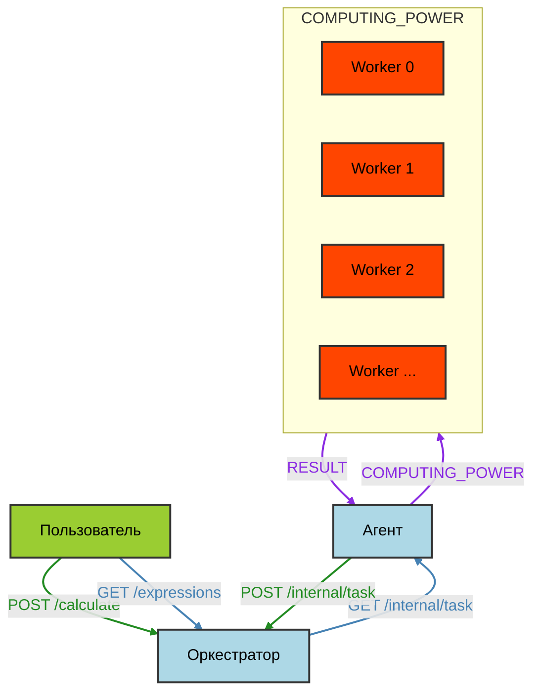

# Yandex-калькулятор V2.0

## Made by Бутер Бродский aka Nyamerka)

Данное api было написано в рамках продолжения прохождения курса разработки на языке Go от Яндекса как развитие предыдущего проекта.

### Как запустить?
Для начала клонируем проект к себе:
```zsh
git clone https://github.com/Nyamerka/Yandex_Calc_V2
```
> [!NOTE]
> Все команды запускаются из корневой папки проекта.

---

Запускаем `Docker`. На компьютер будет установлен образ `Debian`, где будет функционировать весь проект. Все зависимости ставятся внутри контейнера:
```zsh
docker-compose up
```
> [!WARNING]
> Не забудьте установить приложение Docker на свой ПК :space_invader:!

При корректном запуске Вы получите:
```zsh
[+] Running 1/0
 ✔ Container yandex_calc_v20-calculator-1  Created                                                                                                                0.0s 
Attaching to yandex_calc_v20-calculator-1
```
> [!NOTE]
> Возможно, будет долговато :hourglass_flowing_sand:...

При необходимости отчистить кеш и подтянуть изменения проекта можно с помощью следующей команды:
```zsh
docker-compose build --no-cache
```

---

Контейнер тестируется перед запуском с помощью `go test`. Если Вы хотите протестировать проект самостоятельно, то можно использовать команду ниже, находясь в корневой папке проекта:
```zsh
go test ./internal/...
```
> [!NOTE]
> Проект проходит обязательное тестирование перед запуском. Если тестирование провалено - проект не запустится :smiling_imp:.

Результат тестирования должен выглядеть примерно так, однако при первом запуске приписка `(cached)` будет отсутствовать:
```zsh
ok      Yandex_Calc_V2.0/internal/app   (cached)
ok      Yandex_Calc_V2.0/internal/eval  (cached)
ok      Yandex_Calc_V2.0/internal/queue (cached)
ok      Yandex_Calc_V2.0/internal/stack (cached)
```

Для более подробного вывода можно добавить флаг `-v`:
```zsh
go test -v ./internal/...
```
> [!NOTE]
> Большое количество вывода, не пугайтесь :ghost:.

---

### Архитектура проекта



Таким образом, оркестратор создаёт агента, который в свою очередь имеет определённую вычислительную мощность - количество параллельно вычисляющихся задач, на каждую из которых выделяется исполнитель, решающий эту задачу. Worker :fist_raised: - не отдельный класс или структура, а лишь метод агента.

> [!NOTE]
> По умолчанию COMPUTING_POWER = 1, это счётчик горутин. Worker - горутина, выполняющая задачу.

---

### Требования по ТЗ

**Оркестратор**:

Сервер, который принимает арифметическое выражение, переводит его в набор последовательных задач и обеспечивает порядок их выполнения. Сервер, который имеет следующие endpoint-ы:

1. Добавление вычисления арифметического выражения
```zsh
curl --location 'localhost/api/v1/calculate' \
--header 'Content-Type: application/json' \
--data '{
 "expression": <строка с выражение>
}'
```
Тело ответа:
```json
{
 "id": <уникальный идентификатор выражения>
}
```
Коды ответа:
- 201 - выражение принято для вычисления,
- 422 - невалидные данные,
- 500 - что-то пошло не так.

---

2. Получение списка выражений
```zsh
curl --location 'localhost/api/v1/expressions'
```
Тело ответа:
```json
{
    "expressions": [
        {
            "id": <идентификатор выражения>,
            "status": <статус вычисления выражения>,
            "result": <результат выражения>
        },
        {
            "id": <идентификатор выражения>,
            "status": <статус вычисления выражения>,
            "result": <результат выражения>
        }
    ]
}
```
Коды ответа:
- 200 - успешно получен список выражений,
- 500 - что-то пошло не так.

---

3. Получение выражения по его идентификатор
```zsh
curl --location 'localhost/api/v1/expressions/:id'
```
Тело ответа:
```json
{
    "expression":
        {
            "id": <идентификатор выражения>,
            "status": <статус вычисления выражения>,
            "result": <результат выражения>
        }
}
```
Коды ответа:
- 200 - успешно получено выражение,
- 404 - нет такого выражения,
- 500 - что-то пошло не так.

---

4. Получение задачи для выполнения
```zsh
curl --location 'localhost/internal/task'
```
Тело ответа
```json
{
    "task":
        {
            "id": <идентификатор задачи>,
            "arg1": <имя первого аргумента>,
            "arg2": <имя второго аргумента>,
            "operation": <операция>,
            "operation_time": <время выполнения операции>
        }
}
```
Коды ответа:
- 200 - успешно получена задача,
- 404 - нет задачи,
- 500 - что-то пошло не так.

---

5. Прием результата обработки данных.
```zsh
curl --location 'localhost/internal/task' \
--header 'Content-Type: application/json' \
--data '{
  "id": 1,
  "result": 2.5
}'
```
Коды ответа:
- 200 - успешно записан результат,
- 404 - нет такой задачи,
- 422 - невалидные данные,
- 500 - что-то пошло не так.

---

**Агент**

Вычислитель, который может получить от оркестратора задачу, выполнить его и вернуть серверу результат. Агент все время приходит к оркестратору с запросом "дай задачку поработать :speech_balloon:" (в ручку GET internal/task для получения задач). Оркестратор отдаёт задачу.

---

### Документация

В качестве документации был использован `SwaggerUI`. Swagger — это инструмент, который помогает разработчикам создавать, документировать и проверять `API`. Собственно, его прелесть заключается в том, что он дает возможность не только интерактивно просматривать спецификацию, но и отправлять запросы. Сам SwaggerUI доступен по следующей ссылке:

```
http://localhost:8080/swagger/index.html
```

Там же можно протестировать некоторые тестовые запросы, увидеть формы и т.д. в "real time".

> [!CAUTION]
> Проект должен быть запущен для работы Swagger UI :electric_plug:.

---

### Примеры использования

Повторюсь, для тестирования проекта можно использовать SwaggerUI и заготовленные там примеры. Также перед каждым запуском сервер проходит автоматическое тестирование. Однако можно использовать следующие примеры:

1. Добавление выражения:
```zsh
 curl -X POST -H "Content-Type: application/json" -d '{"expression": "3 + 2"}' http://localhost:8080/api/v1/calculate
```

Результат:
```zsh
{"id":"1"}
```

---

2. Добавление неверного выражения:
```zsh
curl -X POST -H "Content-Type: application/json" -d '{"expression": "-1+2--1*((2+3)"}' http://localhost:8080/api/v1/calculate
```

Результат:
```zsh
{"error":"Invalid expression"}
```

---

3. Получить список выражений (всех):
```zsh
 curl GET http://localhost:8080/api/v1/expressions 
```

Результат:
```zsh
{"expressions":[{"id":"1","expression":"3 + 2","status":"completed","result":5}]}
```

> [!NOTE]
> Если поставить значения времени симуляции вычислений, то можно получить и "status":in_progress".

--- 

4. Получить выражение по id (выражение существует):
```zsh
curl GET http://localhost:8080/api/v1/expressions/1
```

Результат:
```zsh
{"expression":{"id":"1","expression":"3 + 2","status":"completed","result":5}}
```

---

5. Получить выражение по id (выражение **НЕ** существует):
```zsh
curl GET http://localhost:8080/api/v1/expressions/1337
```

Результат:
```zsh
{"error":"Expression not found"}
```

---
